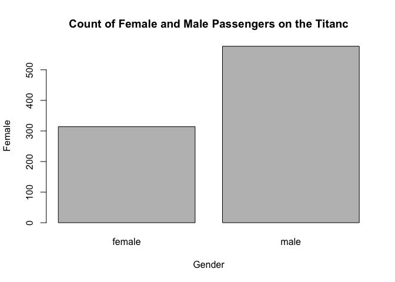
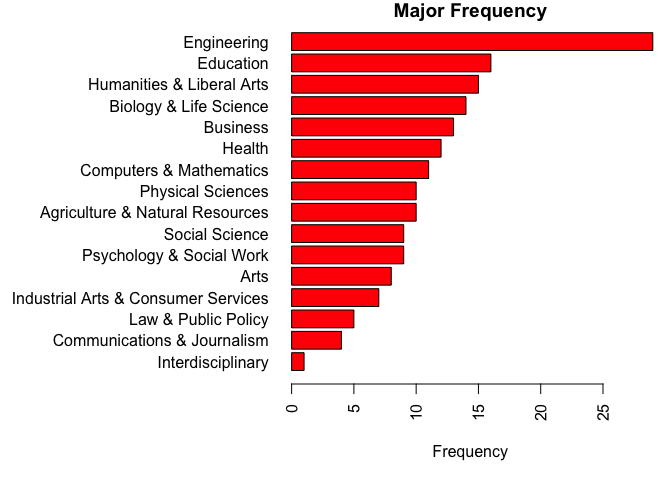

 1
1. GitHub Cloning (20 points): Using Git, clone the following GitHub repository to your local machine: https://github.com/caesar0301/awesome-public-datasets. In RMarkdown, please show the code (commented out, as it’s not R syntax) that you used to create a new directory, navigate to the appropriate directory, and clone the repository to it. One Git command per line, please.

cd desktop
cd SMU
cd DataScience
git clone https://github.com/caesar0301/awesome-public-datasets

2. Data Summary (20 points): From this aforementioned cloned repo, please extract titanic.csv.zip. To be clear, this does not have to be done in Git or command line.
2a.
In R, please read in titanic.csv via either read.table() or read.csv(), assigning it to df. This dataset follows the passengers aboard the Titanic, including their fees paid, rooms rented, and survivorship status.

```r
setwd("/Users/alec/Desktop/SMU/DataScience/week 3")
df=read.csv("titanic.csv")
```
b. Output the respective count of females and males aboard the Titanic. Plot the frequency of females and males. Be sure to give an accurate title and label the axes.

```r
barplot(table(df[,"Sex"]),main="Count of Female and Male Passengers on the Titanc",xlab="Gender",ylab="Female")
```

<!-- -->

c. Please use one apply function (to review: swirl() modules 11, 12) to output the means of Age, Fare, and Survival. Make sure the output is a real number for all three means.

```r
apply(df[,c("Age","Fare","Survived")],2,function(x) mean(na.omit(x)))
```

```
##        Age       Fare   Survived 
## 29.6991176 32.2042080  0.3838384
```
 3
3. Function Building (30 points): You research sleep and just got your first data set. Later, you’ll have another dataset with the same column names, so you want to create a helper function that you can analyze this dataset and the next. Load sleep_data_01.csv (found at http://talklab.psy.gla.ac.uk/L1_labs/lab_1/homework/index.html). Questions 3A through 3D should be answered in function(x){}. 3E can be outside of the function.
a. Create objects for the median Age, the minimum and maximum Duration of sleep, and the mean and standard deviation of the Rosenberg Self Esteem scale (RSES). You may need to specify a few options like in Problem 2 and live session.
b. Create a data.frame object called report: it should consist of the median age, the RSES mean and standard deviation respectively divided by five (since there are five questions and these scores are summed), and the range of Duration (the statistical definition of range; it should be a single number.)
c. Change the column names of this data.frame to MedianAge, SelfEsteem, SE_SD, and DurationRange.
d. Round the report to at most 2 digits: leave this as the closing line to the function.

```r
setwd("/Users/alec/Desktop/SMU/DataScience/week 3/hw3")
sleep=read.csv("sleep_data_01.csv")
gen_report=function(df){
  gen_stats=function(df,colname,stat){
    vector=na.omit(df[,colname])
    if (stat=="sd"){
      return(sd(vector))
    } else if (stat=="min"){
      return(min(vector))
    } else if (stat=="median"){
      return(median(vector))
    } else if (stat=="max"){
      return(max(vector))
    } else if (stat=="mean"){
      return(mean(vector))
    } else {
      print("Invalid statistic name!")
    }
  }
  median_age=gen_stats(sleep,"Age","median")
  bedtime_min=gen_stats(sleep,"Bedtime","min")
  bedtime_max=gen_stats(sleep,"Bedtime","max")
  RSES_mean=gen_stats(sleep,"RSES","mean")
  RSES_sd=gen_stats(sleep,"RSES","sd")
  x1=median_age
  x2=gen_stats(df,"RSES","median")
  x3=RSES_sd/5
  x4=gen_stats(df,"RSES","max")-bedtime_min
  report=cbind(x1,x2,x3,x4)
  colnames(report)=c("MedianAge","SelfEsteem","SE_SD","DurationRange")
  data.frame(t(apply(report,1,function(x) round(x,2))))
}
```
e. Finally, run the function on your sleep data to show the output.

```r
gen_report(sleep)
```

```
##   MedianAge SelfEsteem SE_SD DurationRange
## 1        14         18  1.24         25.25
```
 4
4. FiveThirtyEight Data (30 points): Navigate on GitHub to data(package = "fivethirtyeight") and read README.md. It will include everything you need.
a. Install the fivethirtyeight package.

```r
#install.packages('fivethirtyeight')
library('fivethirtyeight')
```
b. In the listing of Data sets in package ‘fivethirtyeight,’ assign the 22nd data set to an
object ‘df.’

```r
assign('df',eval(as.symbol(as.character(data(package = "fivethirtyeight")[3]$results[22,"Item"]))))
```
c. Use a more detailed list of the data sets to write out the URL in a comment to the related news story.

```r
vignette("fivethirtyeight", package = "fivethirtyeight")
```

```
## starting httpd help server ... done
```

```r
#college_recent_grads
url='https://fivethirtyeight.com/features/the-economic-guide-to-picking-a-college-major/'
```
d. Using R command(s), give the dimensions and column names of this data frame.

```r
str(college_recent_grads)
```

```
## Classes 'tbl_df', 'tbl' and 'data.frame':	173 obs. of  21 variables:
##  $ rank                       : int  1 2 3 4 5 6 7 8 9 10 ...
##  $ major_code                 : int  2419 2416 2415 2417 2405 2418 6202 5001 2414 2408 ...
##  $ major                      : chr  "Petroleum Engineering" "Mining And Mineral Engineering" "Metallurgical Engineering" "Naval Architecture And Marine Engineering" ...
##  $ major_category             : chr  "Engineering" "Engineering" "Engineering" "Engineering" ...
##  $ total                      : int  2339 756 856 1258 32260 2573 3777 1792 91227 81527 ...
##  $ sample_size                : int  36 7 3 16 289 17 51 10 1029 631 ...
##  $ men                        : int  2057 679 725 1123 21239 2200 2110 832 80320 65511 ...
##  $ women                      : int  282 77 131 135 11021 373 1667 960 10907 16016 ...
##  $ sharewomen                 : num  0.121 0.102 0.153 0.107 0.342 ...
##  $ employed                   : int  1976 640 648 758 25694 1857 2912 1526 76442 61928 ...
##  $ employed_fulltime          : int  1849 556 558 1069 23170 2038 2924 1085 71298 55450 ...
##  $ employed_parttime          : int  270 170 133 150 5180 264 296 553 13101 12695 ...
##  $ employed_fulltime_yearround: int  1207 388 340 692 16697 1449 2482 827 54639 41413 ...
##  $ unemployed                 : int  37 85 16 40 1672 400 308 33 4650 3895 ...
##  $ unemployment_rate          : num  0.0184 0.1172 0.0241 0.0501 0.0611 ...
##  $ p25th                      : num  95000 55000 50000 43000 50000 50000 53000 31500 48000 45000 ...
##  $ median                     : num  110000 75000 73000 70000 65000 65000 62000 62000 60000 60000 ...
##  $ p75th                      : num  125000 90000 105000 80000 75000 102000 72000 109000 70000 72000 ...
##  $ college_jobs               : int  1534 350 456 529 18314 1142 1768 972 52844 45829 ...
##  $ non_college_jobs           : int  364 257 176 102 4440 657 314 500 16384 10874 ...
##  $ low_wage_jobs              : int  193 50 0 0 972 244 259 220 3253 3170 ...
```
5. Data Summary (30 points): Use your newly assigned data frame from question 4 for
this question.
a. Write an R command that gives you the column names of the data frame. Right after that, write one that counts the number of columns but not rows. Hint: The number should match one of your numbers in Question 1d for dimensions.

```r
colnames(df)
```

```
##  [1] "rank"                        "major_code"                 
##  [3] "major"                       "major_category"             
##  [5] "total"                       "sample_size"                
##  [7] "men"                         "women"                      
##  [9] "sharewomen"                  "employed"                   
## [11] "employed_fulltime"           "employed_parttime"          
## [13] "employed_fulltime_yearround" "unemployed"                 
## [15] "unemployment_rate"           "p25th"                      
## [17] "median"                      "p75th"                      
## [19] "college_jobs"                "non_college_jobs"           
## [21] "low_wage_jobs"
```

```r
ncol(df)
```

```
## [1] 21
```
b. Generate a count of each unique major_category in the data frame. I recommend using libraries to help. To be clear, this should look like a matrix or data frame containing the major_category and the frequency it occurs in the dataset. Assign it to major_count.

```r
mat=as.data.frame(table(df[,"major_category"]))
colnames(mat)=c("Major","Frequency")
mat=mat[order(mat[,2]),]
```
c. To make things easier to read, put par(las=2) before your plot to make the text perpendicular to the axis. Make a barplot of major_count. Make sure to label the title with something informative (check the vignette if you need), label the x and y axis, and make it any color other than grey. Assign the major_category labels to their respective bar. Flip the barplot horizontally so that bars extend to the right, not upward. All of these options can be done in a single pass of barplot(). Note: It’s okay if it’s wider than the preview pane.

```r
par(mar=c(5,15,1,1))
barplot(mat[,"Frequency"],horiz=T,names.arg = mat[,"Major"],las=2,xlab="Frequency",col="red",main="Major Frequency")
```

<!-- -->


d. Write the fivethirtyeight data to a csv file. Make sure that it does not have row labels.

```r
write.csv(df,"fivethirtyeight_data.csv",row.names =FALSE)
```

6. Codebook (30 points):
a. Start a new repository on GitHub for your SMU MSDS homework. On your local device, make sure there is a directory for Homework at the minimum; you are welcome to add whatever you would like to this repo in addition to your requirements here.

```r
url=paste0("https://github.com/lepealec/SMU-63606.git")
url
```

```
## [1] "https://github.com/lepealec/SMU-63606.git"
```

b. Create a README.md file which explains the purpose of the repository, the topics
included, the sources for the material you post, and contact information in case of questions. Remember, the one in the root directory should be general. You are welcome to make short READMEs for each assignment individually in other folders.

```r
# SMU-Doing-Data-Science

# Fall 2018 SMU Doing Data Science Course 6306
# Contact info: alepe@smu.edu
# More info to come
```

c. In one (or more) of the nested directories, post your RMarkdown script, HTML file, and data from ‘fivethirtyeight.’ Make sure that in your README or elsewhere that you credit fivethirtyeight in some way.

```r
dir.create("HW3")
setwd(paste0(getwd(),"/HW3",collapse = ""))
```


d. In your RMarkdown script, please provide the link to this GitHub so the grader can see it.

```r
URL=paste0("https://github.com/lepealec/SMU-Doing-Data-Science")
URL
```

```
## [1] "https://github.com/lepealec/SMU-Doing-Data-Science"
```

